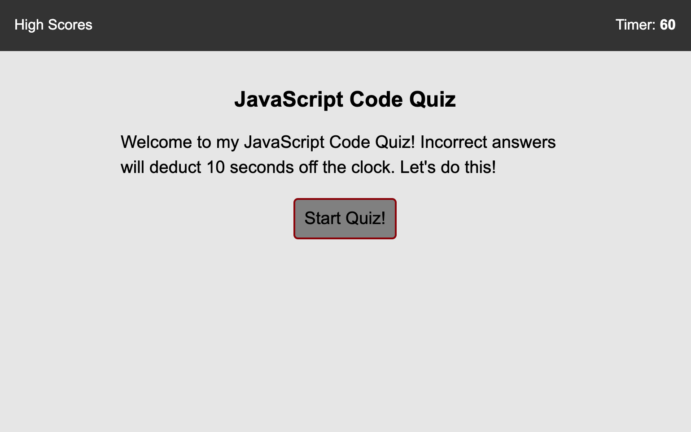
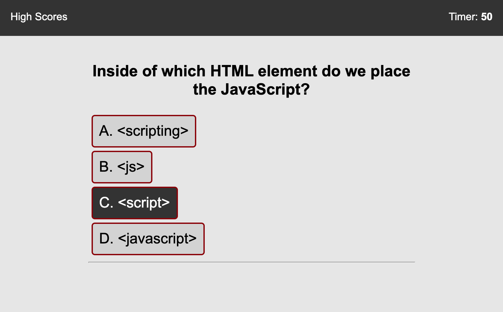
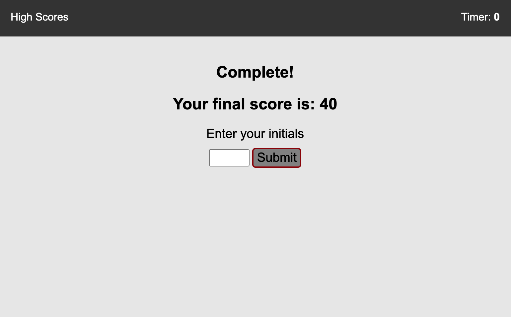
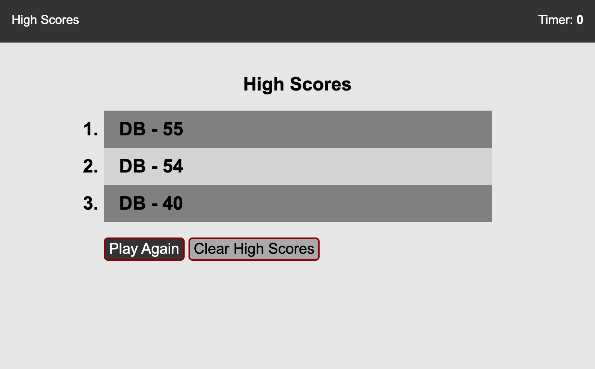

# Week 4 - Web APIs: Code Quiz

## Project Description

This project was to make a JavaScript Quiz API that incorporated the following:

- must be timed
- must present multiple choice questions
- must store and display high score list
- must match mock-up functionality

## Screenshots

